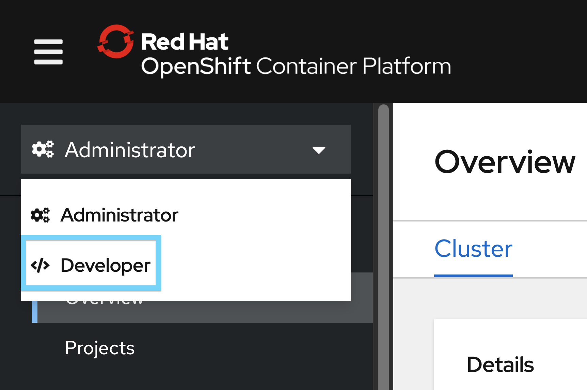
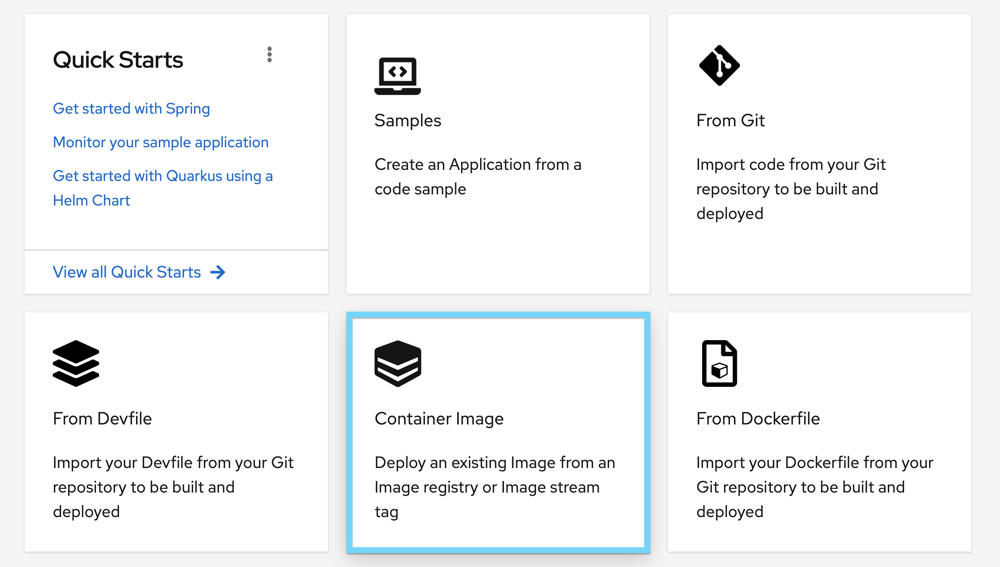
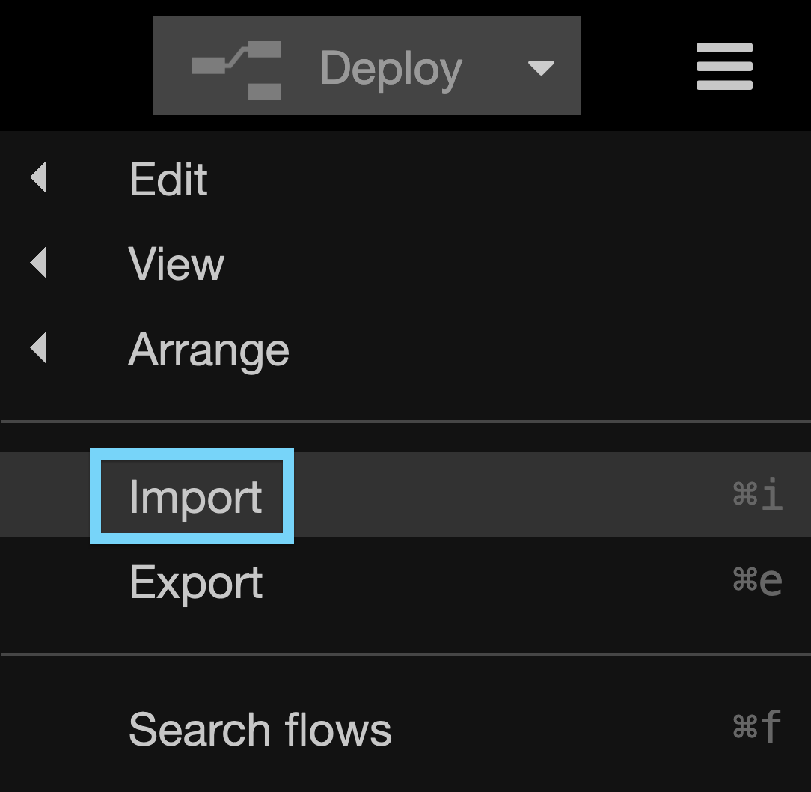
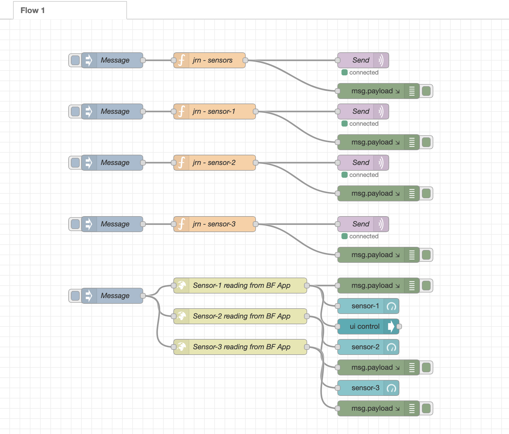
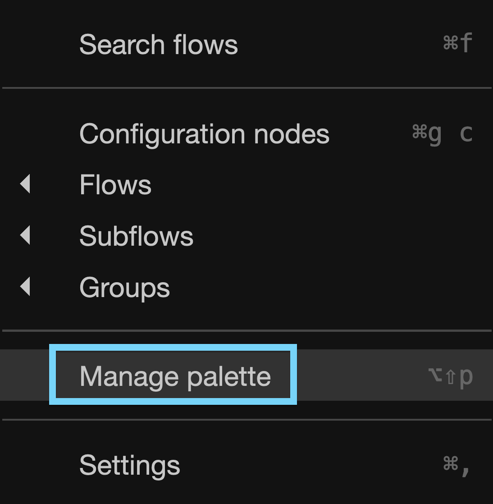
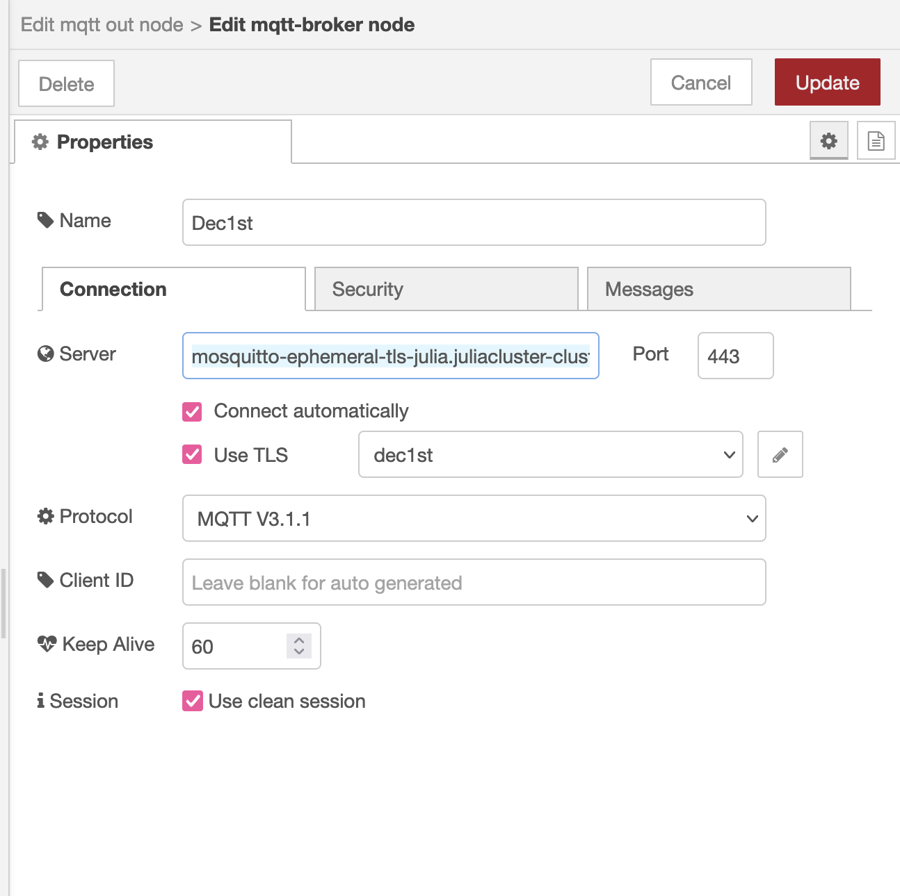
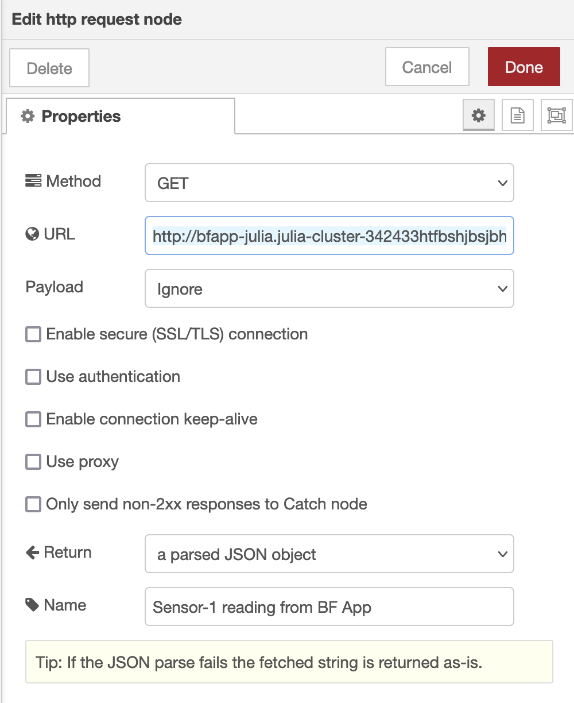
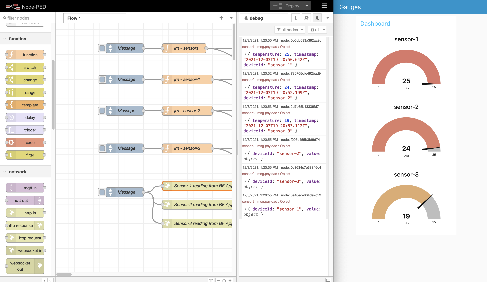

# Cloud Satellite Hybrid IoT Use Case

This repository hosts the source code of the demo that features an industrial use case for Cloud Satellite.

We will setup and run a Mosquitto (MQTT broker) service inside the cluster and run a Node app inside the cluster. The Node app bridges the connection between MQTT messages being sent from Node-Red locally and subscribes to MQTT messages along a defined topic. In this case, "sensors" is the topic. When the Node "bridge" app gets an MQTT message from the topic queue it will publish the message to Redis. 

Once the data has been pushed into Redis, a backend-to-frontend Node application will pull the data out from Redis to display the readings visually in a Node-Red UI dashboard. 

# OpenShift cluster

In order to run this demo, you need an OpenShift cluster up and running.

Refer to the [documentation](https://cloud.ibm.com/docs/satellite) to set up a Cloud Satellite cluster.

Once you have your cluster up and running, create a new namespace for the project, such as `iotdemo`. 

# Set Internal Registry on Cloud Satellite

OpenShift clusters have an internal registry and we need to patch the configuration so the operator creates a deployment and registry service for the project. Follow this [documentation](https://cloud.ibm.com/docs/openshift?topic=openshift-registry#emptydir_internal_registry) to create the registry service.

Remember to check the pods to make sure the registry is good to go. We cannot pull container images if this step is not completed successfully.

    oc get pods -n openshift-image-registry

# Eclipse Mosquitto for MQTT deployment
We need to deploy Mosquitto as a message broker. 

To do this, login to your cluster through the terminal. Change into the root directory of the project. Then execute this command to deploy Mosquitto. 

    oc apply -f deploy-mosquitto.yaml 

You should see that the DeploymentConfig and Services are created in the cluster:

    deploymentconfig.apps.openshift.io/mosquitto-ephemeral created
    service/mosquitto-ephemeral-tcp created
    service/mosquitto-ephemeral-tls created

Additionally, there needs to be a route created to access Mosquitto from Node-Red locally. 
Use  `mqtt-route.yaml` to create this route.
     
     
    oc apply -f mqtt-route.yaml

# Redis deployment

    oc apply -f deploy-redis.yaml

This will deploy Redis in the cluster. 

# Bridge App

Next we will be pushing the bridge app container image into [Docker Hub](https://hub.docker.com/) to instantiate the app within the cluster. If you don't have an account with Docker Hub, create one. 

If you don't want to create a Docker Hub account and have not modified the service names in the YAML files for Mosquitto, then you can use this image `sunshinejulia/bridgeapp` to deploy the given image, skip the below Docker Hub step and resume to the [next section](#deploy-bridge-app-to-cluster).

If you do want to use your own Docker Hub and not the given image, have `bridgeapp` as your working directory. Now we build the `bridgeapp` image. The docker build command creates a Docker image from the given Dockerfile.

    docker build -t yourdockerhubusername/bridgeapp .

Push this image to Docker Hub.

    docker push yourdockerhubusername/bridgeapp

# Deploy Bridge App to Cluster
Go to your OpenShift cluster and change your view from `Administrator` to `Developer`. 

Then go into `+Add` and select the `Container Image` catalog tile. Fill out the given information for your container image.

# BF App

Repeat the same deployment that we did with the bridge app for the BF application. The backend for frontend application pulls the data from Redis in the cluster to display in a Node-Red UI dashboard. 

Change to have `bfeapp` as your working directory and repeat the process done for the bridge app earlier in this tutorial. Build the image in your own repository on Docker Hub or by deploying the image `sunshinejulia/bfapp` in the cluster given you have not changed the Mosquitto service name in the YAML files of the project.

Once the BF application is up and running, you should see this output in the logs of the Pod:

    Running on http://0.0.0.0:8080
    redis client connected

# Node-Red Setup

Set up Node-Red locally by following this [documentation](https://nodered.org/docs/getting-started/local). 

Import the `node-red_flows` JSON flow into Node-Red from the root directory of the project. 

The flow will look like this in Node-Red.

You should immediately have an error that a certain node is not installed for different nodes in your flow. 

Install the palette module of `node-red-dashboard` in the `Palette` section of Node-Red. 

This module will be used to show the sensory readings.

# Connect to Mosquitto in Node-Red

Then, follow the steps to create a self-signing certificate under "Get the CA certificate from the image" section in this [article](https://developers.redhat.com/blog/2021/04/26/deploying-the-mosquitto-mqtt-message-broker-on-red-hat-openshift-part-2#deploying_a_default_image_on_openshift). Test this connection by using `mosquitto_pub` under the "Test the installation" section in the article. Look at the logs on the Pod. 
Success will look like:

    New connection from [IP] on port 8883.
    New client connected from [IP] as auto-327GDS-32FD-32FD-85AF-EEJKEJK (p2, c1, k60, u'admin').
    Client auto-327GDS-32FD-32FD-85AF-EEJKEJK disconnected.

# Update Node Values

Values within the JSON need to be changed in order for this to work with your setup. You can apply changes through the Node-Red GUI by clicking on the nodes to open them.

The MQTT-broker `Send` nodes need to be updated with the Mosquitto route configured in previous steps as well as the SSL/TLS certificate retrieved from the image.

The HTTP request node needs to be updated with the route for the BF app given the sensor reading to be displayed on the Node-Red dashboard. See this URL path as an example.

    http://bfapp-julia.julia-cluster-747834bhjdsbhjds-0000.upi.containers.appdomain.cloud/readings?deviceId=sensor-1

Populate the URL for each sensor.

# Deploy

Once done with the updates of the Node-Red nodes, press `Deploy` to deploy the flow and wait a few minutes for the nodes to connect. Press the button on the `Messages` node in order to update the randomly-generated sensor readings. 

Press the `Message` node connected to the BF app to send the GET request for these readings to be displayed in the Node-Red UI dashboard. 

